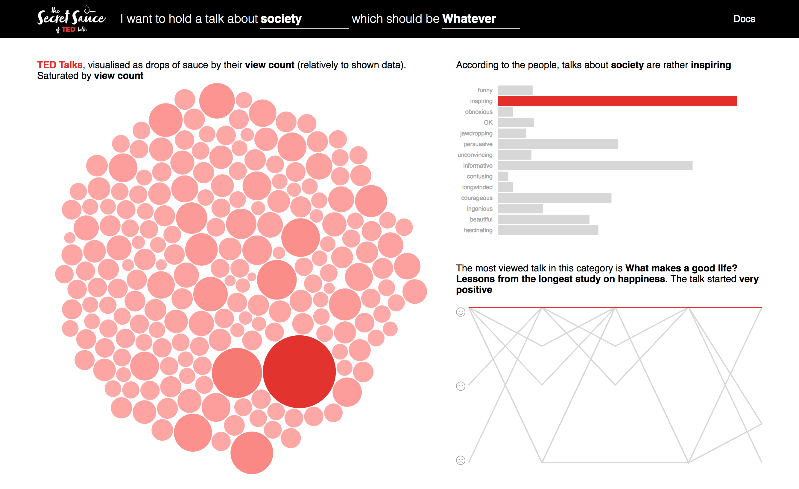

# The Secret Sauce of TED Talks

A visualization of more than 2000 TED talks. Made as a project in ivis @ FHNW.


## Getting started

In order to setup the visualization for yourself, clone the repository first.

```
cd ivis-ted-visualization
```

Afterwards, you need to run a http-server. I recommend using [Simple HTTP-Server](https://github.com/indexzero/http-server) and start it.

```
http-server
```

If navgate to the link, you should be able to see the visualisation.



## Docs

The visualization is divided into 3 parts. The first & biggest one, the collection of dots represent all TED talks. In default, they are sized and colored by view count. However with filtering by category (first select-box in header), you can show only the TED talks that are in that category. By filtering by rating (second select-box in header), the saturation will be adapted by that. The more red = the more people rated this talk as selected. By hovering over a bubble, the title and view count of the talk will be shown. By clicking on it, you get directly to the talk's website and can watch it. Enjoy!

The second visualization, on top on the right side shows the percentage division of the current showed talks by rating. The third visualization on the bottom right, shows the sentiment of the top 30 talks (by view count). The sentiment of a talk was calulated in 5 parts by analysing the transcripts of each talk. By hovering over a line, the full path will be clearly shown as well as the corresponding dot in the "big bubble chart" on the left.

This visualization can be used to gather information about the talk you want to do. By selecting the category and the rating you want, you can analyse the sentiment your talk needs (like if it should start positive or negative) and see how others made talks like yours. Happy talking!

## Demo

[https://yannickpulver.com/ivis/](https://yannickpulver.com/ivis/)


